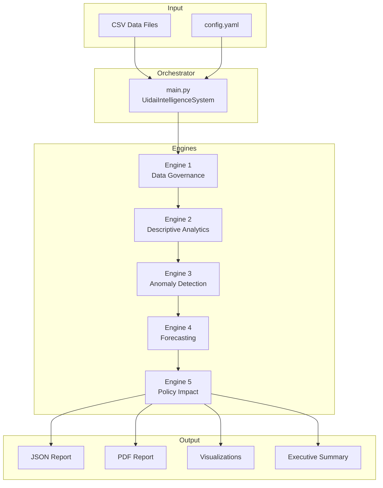

# System Architecture

## Overview

The UIDAI Intelligence System is a modular analytical platform consisting of five specialized engines orchestrated by a master controller.



## Engine Descriptions

### Engine 1: Data Governance & Quality
- **Purpose**: Validate data quality before analysis
- **Key Metrics**: Data Reliability Index (DRI), completeness, consistency, validity
- **Output**: Quality report with actionable recommendations

### Engine 2: Descriptive Analytics
- **Purpose**: Extract patterns and insights from enrollment data
- **Key Analyses**: Temporal trends, geographic patterns, age demographics, inequity detection
- **Output**: Statistical summaries and pattern identification

### Engine 3: Anomaly Detection
- **Purpose**: Identify unusual patterns requiring attention
- **Methods**: Z-score, IQR, Isolation Forest, temporal spike detection
- **Output**: Anomaly flags with severity scores

### Engine 4: Forecasting & Prediction
- **Purpose**: Predict future enrollment demand
- **Models**: SARIMA, Holt-Winters, XGBoost, LightGBM, Ensemble
- **Output**: 6-month forecasts with confidence intervals

### Engine 5: Policy Impact Analysis
- **Purpose**: Support resource planning and policy decisions
- **Analyses**: Priority scoring, resource allocation, intervention identification
- **Output**: Strategic recommendations and action plans

## Data Flow

1. **Load** → Data loaded from CSV files via `UidaiDataLoader`
2. **Validate** → Schema and quality checks via Data Governance Engine
3. **Analyze** → Sequential engine execution with data passing
4. **Generate** → Reports, visualizations, and recommendations
5. **Save** → Outputs persisted to `outputs/` directory

## Directory Structure

```
uidai-intelligence-system/
├── config/              # Configuration files
├── engines/             # 5 analytical engines
├── utils/               # Data loading, visualization, PDF generation
├── tests/               # Unit tests
├── docs/                # Technical documentation
├── outputs/             # Generated reports and visualizations
└── main.py              # Master orchestrator
```

## Configuration

All engines read from `config/config.yaml`:
- Data paths and schema definitions
- Quality thresholds (DRI, anomaly detection)
- Forecasting parameters (horizons, confidence levels)
- Policy parameters (optimal ratios)
- Ethics settings (k-anonymity)
